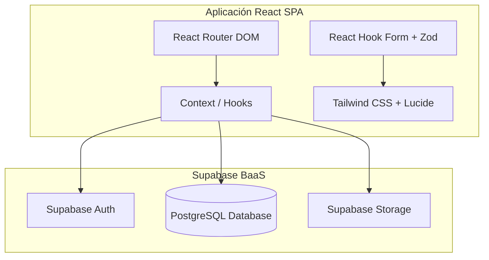
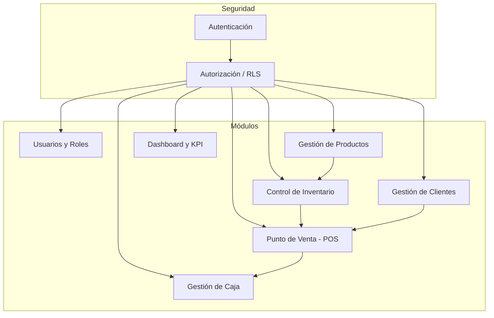
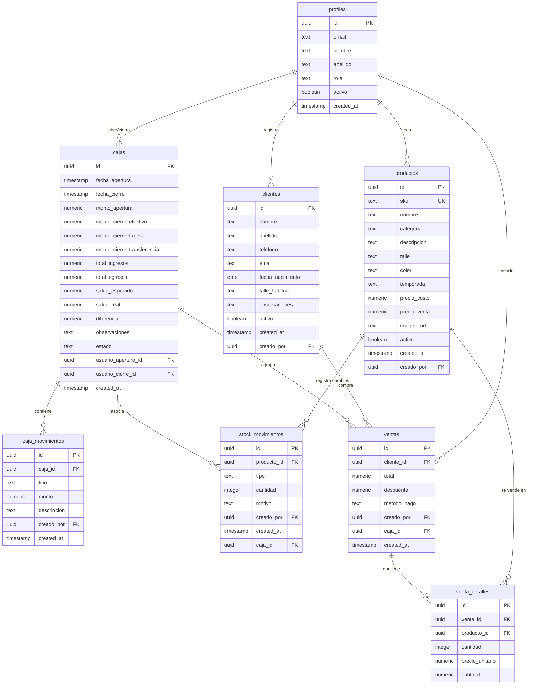

# Mauro Sergio Manager - Plan de Implementación General (Fase 0)

Este documento detalla la arquitectura de software, modelo de datos, diseño de navegación y la estrategia de seguridad para **Mauro Sergio Manager**, un sistema de gestión comercial para una franquicia de indumentaria de la marca Mauro Sergio.

---

## Arquitectura de la Solución

El sistema se diseñará bajo una arquitectura desacoplada de tipo **SaaS Monopágina (SPA)**, interactuando directamente con una infraestructura serverless como servicio (Backend-as-a-Service) a través de **Supabase**.



### Tecnologías Clave:
*   **Frontend**: React (Vite) + JavaScript/TypeScript.
*   **Enrutamiento**: React Router v6.
*   **Estilos y UI**: Tailwind CSS (con diseño premium responsivo) + Lucide Icons.
*   **Gestión de Formularios**: React Hook Form con validación de esquemas vía Zod.
*   **Base de Datos & Backend**: PostgreSQL provisto por Supabase.
*   **Autenticación**: Supabase Auth (Email/Contraseña).
*   **Almacenamiento**: Supabase Storage para fotos de productos.
*   **Seguridad**: Row Level Security (RLS) en PostgreSQL.

---

## Diagrama Lógico de Módulos

El sistema está compuesto por componentes lógicos interconectados, donde la seguridad transversal controla el flujo de datos:



---

## Diseño de Navegación

La aplicación implementa un diseño responsivo con barra lateral (**Sidebar**) colapsable en pantallas pequeñas. Las rutas están protegidas en el cliente según el rol del usuario autenticado.

### Estructura de Rutas
*   `/login` -> Vista pública de acceso.
*   `/recuperar` -> Vista pública para reestablecer contraseña.
*   `/` -> Dashboard Principal (Redirección condicional).
*   `/clientes` -> Gestión de clientes (CRUD, búsquedas).
*   `/productos` -> Catálogo de indumentaria (Filtros, CRUD).
*   `/stock` -> Control de stock, movimientos e historial.
*   `/ventas` -> Registrar ventas (POS, Carrito).
*   `/caja` -> Control de caja diaria (Aperturas, Cierre, Historial).
*   `/usuarios` -> Administración de usuarios y roles (Solo Administrador).

### Acceso de Rutas por Rol:
| Ruta | Administrador | Vendedor | Descripción |
| :--- | :---: | :---: | :--- |
| `/login` | Sí | Sí | Público si no hay sesión activa |
| `/recuperar` | Sí | Sí | Público |
| `/` | Sí | Sí | Panel de estadísticas / KPIs básicos |
| `/clientes` | Sí | Sí | Gestión de clientes |
| `/productos` | Sí | Solo Lectura | Gestión o consulta del catálogo |
| `/stock` | Sí | Solo Lectura | Movimientos vs Consulta de inventario |
| `/ventas` | Sí | Sí | Registro de operaciones de venta |
| `/caja` | Sí | Sí (Limitado) | Registro de ingresos/egresos y aperturas |
| `/usuarios` | Sí | No | Panel administrativo de personal |

---

## Modelo Conceptual de Datos

El motor de base de datos será PostgreSQL. Se mantendrá integridad referencial fuerte y control de borrados (Bajas Lógicas usando campo `activo`).



---

## Estrategia de Autenticación y Autorización

### 1. Autenticación (Supabase Auth)
*   Uso de Supabase Auth para la gestión de tokens JWT y sesiones.
*   Registro y validación de usuarios gestionados internamente por administradores en la aplicación para evitar el registro libre (auto-registro deshabilitado o restringido).

### 2. Autorización (Row Level Security - RLS)
Para evitar accesos indebidos de usuarios vendedor a configuraciones o datos restringidos, todas las tablas tendrán RLS activo (`ALTER TABLE ENABLE ROW LEVEL SECURITY`).

#### Funciones Auxiliares SQL (Security Definer)
Se creará una función segura para comprobar el rol del usuario autenticado sin incurrir en recursión en las políticas de seguridad:

```sql
CREATE OR REPLACE FUNCTION public.check_user_role(required_role text)
RETURNS boolean SECURITY DEFINER AS $$
BEGIN
  RETURN EXISTS (
    SELECT 1 FROM public.profiles
    WHERE id = auth.uid() AND role = required_role AND activo = true
  );
END;
$$ LANGUAGE plpgsql;
```

#### Reglas de Acceso a Tablas:
*   **`profiles`**:
    *   Lectura: Todos los usuarios autenticados.
    *   Escritura: Solo administradores (`check_user_role('administrador')`).
*   **`clientes`**:
    *   Lectura/Escritura: Todos los usuarios autenticados (Vendedor y Administrador).
*   **`productos`**:
    *   Lectura: Todos los usuarios autenticados.
    *   Escritura: Solo administradores.
*   **`stock_movimientos`**:
    *   Lectura: Todos los usuarios autenticados.
    *   Escritura: Solo administradores para ajustes directos. Registro automático gatillado en ventas.
*   **`ventas` y `venta_detalles`**:
    *   Lectura/Escritura: Todos los usuarios autenticados (Vendedores registran sus ventas).
*   **`cajas`**:
    *   Lectura: Todos los usuarios autenticados.
    *   Escritura (Cierre/Diferencias): Solo administradores o usuario que abrió la caja correspondiente.
*   **`caja_movimientos`**:
    *   Lectura/Escritura: Todos los usuarios autenticados.

---

## Estructura Inicial del Proyecto

Se adoptará la siguiente estructura limpia para garantizar la mantenibilidad:

```text
APP MAURO SERGIO/
├── supabase/
│   ├── migrations/             # Migraciones SQL organizadas por versión
│   └── config.toml             # Configuración local de Supabase
├── src/
│   ├── assets/                 # Imágenes, logotipos y recursos globales
│   ├── components/             # Componentes de presentación reutilizables
│   │   ├── ui/                 # Componentes base (Botones, inputs, modales, etc.)
│   │   └── layout/             # Componentes de estructura (Sidebar, Navbar, Layout general)
│   ├── context/                # Contextos globales (AuthContext, ThemeContext, CajaContext)
│   ├── hooks/                  # Custom hooks reactivos (useAuth, useCaja, etc.)
│   ├── lib/                    # Configuración de clientes (supabase.js)
│   ├── pages/                  # Vistas del sistema organizadas por módulo
│   │   ├── auth/               # Login, Recuperar Contraseña
│   │   ├── dashboard/          # Métricas y KPIs
│   │   ├── clients/            # CRUD Clientes
│   │   ├── products/           # Catálogo
│   │   ├── stock/              # Inventario e historial
│   │   ├── sales/              # Punto de venta (POS)
│   │   ├── cash/               # Caja Diaria
│   │   └── users/              # Usuarios y Roles
│   ├── router/                 # Configuración de rutas y guards (Rutas protegidas)
│   ├── services/               # Clientes API para supabase (consultas separadas del UI)
│   ├── types/                  # Definiciones TypeScript (si aplica)
│   ├── utils/                  # Funciones de utilidad (formato de dinero, fechas, etc.)
│   ├── App.css
│   ├── App.jsx
│   ├── index.css               # Estilos globales y Tailwind CSS
│   └── main.jsx
├── .env.example                # Variables de entorno requeridas
├── index.html
├── package.json
├── tailwind.config.js
└── vite.config.js
```

---

## Plan de Implementación por Etapas

Para asegurar una entrega robusta y de bajo riesgo de errores, la implementación se dividirá en 9 etapas consecutivas:

| Etapa | Módulo | Entregables Principales |
| :--- | :--- | :--- |
| **Etapa 1** | **Usuarios y Roles** | Migraciones iniciales SQL, tabla `profiles`, Trigger para crear perfiles desde auth, UI de administración de usuarios. |
| **Etapa 2** | **Inicio de Sesión** | Pantalla de login premium, guardias de ruta de React Router, persistencia de sesión con Supabase Auth. |
| **Etapa 3** | **Recuperación** | Formulario de recuperación de contraseña, integraciones con el envío de correos de Supabase. |
| **Etapa 4** | **Clientes** | CRUD clientes (campos requeridos, baja lógica), optimización de formulario responsivo. |
| **Etapa 5** | **Productos** | Catálogo con carga de imágenes (Supabase Storage Bucket), SKU único, búsqueda y filtros avanzados. |
| **Etapa 6** | **Stock** | Ajustes manuales e historial, alertas visuales de stock mínimo (stock crítico). |
| **Etapa 7** | **Ventas** | Interfaz de carrito POS, selección ágil de cliente, transacciones de venta e impacto en stock (Trigger/Función RPC). |
| **Etapa 8** | **Caja** | Turnos de caja (Apertura/Cierre), control de diferencias, libro diario de movimientos. |
| **Etapa 9** | **Dashboard** | KPIs financieros, gráficos de tendencias, reportes rápidos listos para exportar. |

---

## User Review Required

> [!IMPORTANT]
> **Esquema de Autenticación de Supabase**:
> Por defecto, Supabase permite el autoregistro público. Configuraremos políticas para que la creación de usuarios la realice el Administrador registrándolos y forzando una contraseña inicial, deshabilitando el auto-registro abierto para evitar el ingreso no autorizado al backend.
>
> **Bajas Lógicas**:
> En lugar de borrar registros físicos (DELETE) para clientes y productos, utilizaremos un atributo `activo: boolean`. Esto previene romper históricos en ventas y caja. ¿Se encuentra de acuerdo con esta política estándar?

---

## Open Questions

> [!NOTE]
> * **Talle Habitual en Clientes**: ¿Los talles de indumentaria se deben poder elegir de un listado cerrado (ej. S, M, L, XL, 38, 40, etc.) o debe ser un campo de texto libre?
> * **Notificación de Stock Mínimo**: ¿Las alertas de stock mínimo se deben definir de forma general (ej: alertar cuando queda menos de 5 de cualquier producto) o se debe parametrizar un stock mínimo individual para cada producto?

---

## Verification Plan

### Manual Verification
1. Verificar que el flujo del diagrama de navegación cubra el acceso limitado según el rol seleccionado.
2. Comprobación del diagrama lógico y la integridad de las tablas a través de sentencias de prueba PostgreSQL.
